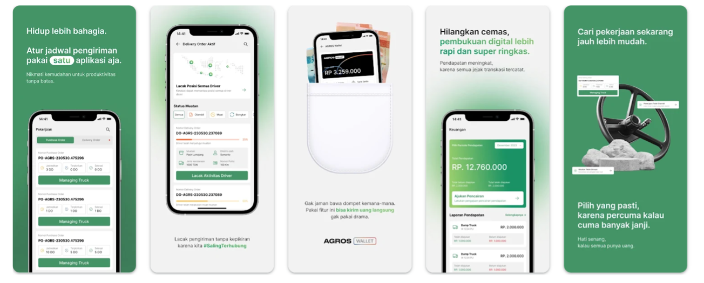
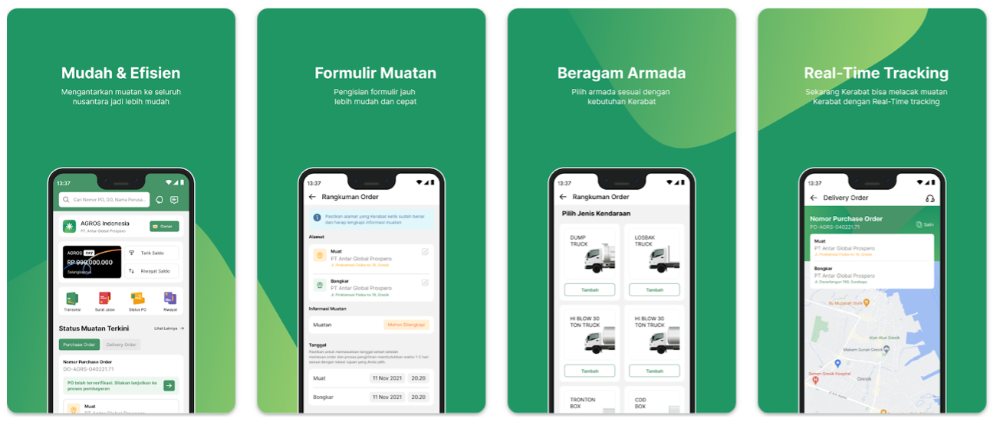
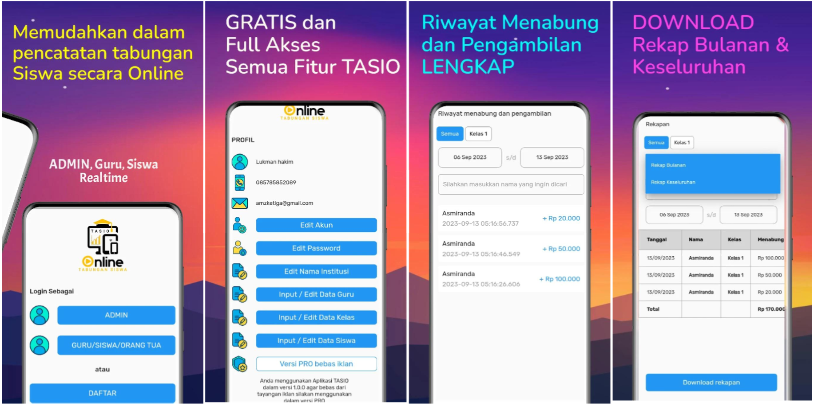
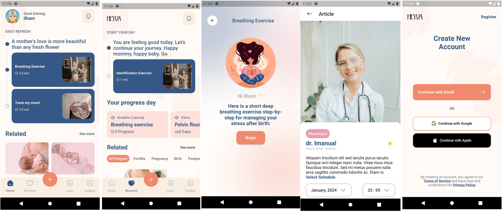
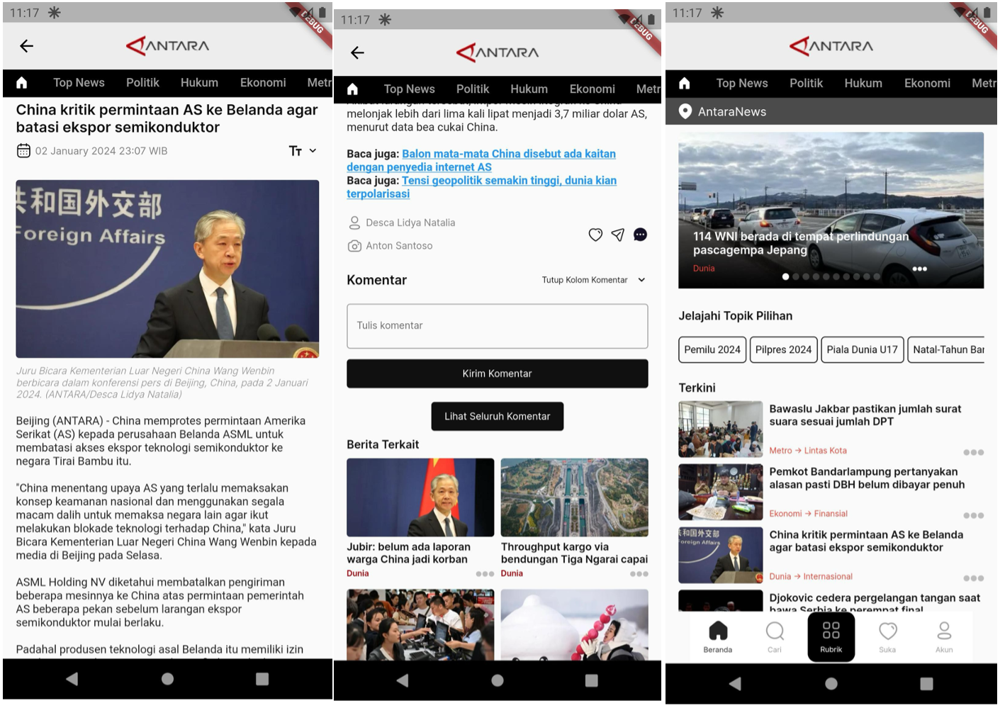

# Muhammad Yusuf Efendi - Flutter Developer Portfolio

Welcome to my portfolio! I am a dedicated Flutter Developer with expertise in building robust, scalable, and user-friendly mobile applications. Below is an overview of some key projects I have successfully developed and deployed.

---

## 🚛 AGROS Partner
An app designed for transporters and drivers to streamline logistic operations.

  

### Features:
- Two roles: Driver and Transporter
- Real-time driver tracking with Google Maps
- FCM Notifications with custom icons and sounds
- Firebase Crashlytics for error monitoring
- Clean architecture and GetX for state management
- File download functionality
- Uploaded to both Play Store and App Store

### Links:
- [Play Store](https://play.google.com/store/apps/details?id=com.agros.logistic&hl=in&gl=US)
- [App Store](https://apps.apple.com/id/app/agros-partner/id6474294191?l=id)

---

## 📦 AGROS Shipper
An app for creating cargo orders and assigning them to transporters and drivers.

  

### Features:
- Order creation and management
- FCM Notifications with custom icons and sounds
- Clean architecture and GetX for state management
- Firebase Crashlytics for monitoring
- File download functionality
- Published on Play Store and App Store

### Links:
- [Play Store](https://play.google.com/store/apps/details?id=com.agros.shipper.agrosShipper)
- [App Store](https://apps.apple.com/id/app/agros/id1603364371?l=id)

---

## 💰 TASIO
An application for savings management, targeting students and institutions.

  

### Features:
- Real-time savings data
- Downloadable recapitulations
- Date filtering, rankings, and graphical representations
- Firebase Firestore and Auth integration
- AdMob for monetization
- Clean architecture using MVVM/MVC pattern
- Published on Play Store

### Links:
- [Play Store](https://play.google.com/store/apps/details?id=com.tasio.app&hl=en-ID)

---

## 🩺 Heyvva Health
A digital health app for pregnant women to access relevant information before, during, and after pregnancy.

  

### Features:
- News and article listing
- Login with Google and Apple accounts
- Registration and login system
- Mood tracker for users
- API integrations and Figma-based design
- Clean architecture using MVVM/MVC pattern

---

## 📰 Antara News Apps
A news portal application for delivering real-time news.

  

### Features:
- Dynamic API integration for news articles
- Clean architecture with MVVM/MVC pattern
- Designed with Figma
- State management with GetX

---

## 🛠 Skills
- **Flutter**: Building cross-platform applications
- **State Management**: Expertise in GetX
- **Architecture**: Clean architecture, MVVM, MVC patterns
- **Firebase**: Firestore, Authentication, Crashlytics
- **Version Control**: GitLab and GitHub
- **UI Design**: Proficient in translating Figma designs to code
- **APIs**: Integration of RESTful APIs
- **Real-time Tracking**: Google Maps integration for live updates

---

## 💼 Let's Collaborate!
Feel free to explore the projects, and if you have any inquiries or collaboration ideas, don’t hesitate to get in touch!

---

### Note:
Replace the `path-to-image` with the actual file paths of the images in your repository. For example, if your images are in a folder named `assets`, the path should be `assets/agros_partner.png`.
